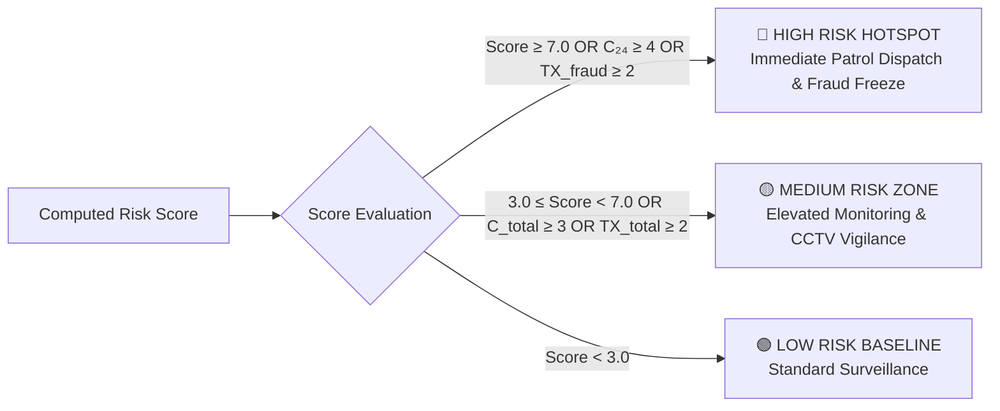

# 🛡️ SENTINEL — Cybercrime Cash-Withdrawal Hotspot Prediction Engine

[](https://www.python.org/)
[](#)
[](#)
[](#)
[](#)

> **SENTINEL** is a spatiotemporal predictive intelligence framework and GIS command center built to forecast, pinpoint, and neutralize cybercrime cash-withdrawal hotspots. By fusing reported cyber incident velocity, geographical proximity clustering, ATM terminal networks, and banking transaction ledgers, SENTINEL empowers Law Enforcement Agencies (LEAs) and Bank Vigilance units to shift from reactive case filing to **proactive cash-drain interception**.

---

## 📌 Table of Contents

- [Executive Summary & Problem Statement](#-executive-summary--problem-statement)
- [Key Features & Capabilities](#-key-features--capabilities)
- [Mathematical Formulation & Risk Scoring Model](#-mathematical-formulation--risk-scoring-model)
- [System Architecture](#-system-architecture)
- [Datasets & Schemas](#-datasets--schemas)
- [REST API Reference](#-rest-api-reference)
- [Interactive GIS Command Center](#-interactive-gis-command-center)
- [Installation & Quick Start](#-installation--quick-start)
- [Automated Verification & Testing](#-automated-verification--testing)
- [Project Directory Structure](#-project-directory-structure)
- [Privacy, Ethics & Security Safeguards](#-privacy-ethics--security-safeguards)
- [Future Roadmap (I4C / 1930 Integration)](#-future-roadmap)

---

## 🚨 Executive Summary & Problem Statement

In contemporary financial cyber fraud (such as phishing, lottery scams, KYC updating frauds, SIM swap takeovers, and UPI deceptions), perpetrators face a fundamental bottleneck: **converting illicit digital balances into untraceable physical currency**.

To evade automatic account freezes:
1. Stolen funds are swiftly routed across layered **mule accounts**.
2. Organized money-mule handlers dispatch local runners to withdraw cash from nearby **ATMs** within narrow timeframes (often 24 to 72 hours of the compromise).
3. Traditional police responses remain strictly **post-incident**, beginning days or weeks after the cash has already been drained.

**SENTINEL** solves this challenge by continuously monitoring the spatiotemporal clustering of cyber complaints around physical ATMs, correlating suspect telecom footprints, tracking banking ledgers, and computing dynamic risk scores to trigger **pre-emptive police patrols and bank fraud desk warnings**.

---

## ✨ Key Features & Capabilities

### 1. Spatiotemporal Risk Scoring Engine (`risk_engine.py`)
- **Haversine Distance Clustering**: Calculates spherical great-circle distances ($R = 3.0\text{ km}$ perimeter default, adjustable up to 8.0 km) between ATMs and incident locations.
- **Sliding Temporal Windows**: Dynamic temporal velocity weighting prioritizing recent incidents ($W_{24}$, $W_{48}$, $W_{72}$).
- **Repeat Suspect Telecom Detection**: Tracks anonymized cryptographic phone hashes (`phone_hash`) linking multiple complaints across different victims.
- **Forced Withdrawal Gravity Multiplier**: Elevates risk scores when prior cyber complaints explicitly flag cash drains at a specific terminal.

### 2. Multi-Channel Banking Transaction Ledger Linkage
- Ingests **30,000+ banking transactions** across ATM withdrawals, UPI, NET_BANKING, NEFT, RTGS, IMPS, POS, and Cash Deposits.
- Automatically correlates ATM terminal IDs and suspect phone hashes to identify high-velocity mule withdrawals and flagged fraud activities.

### 3. Tactical GIS Command Center (`static/index.html`, `static/app.js`)
- **Interactive Multi-Provider Basemaps**: Seamless switching between:
  - 🌙 CartoDB Dark Matter *(Default, free, zero keys required)*
  - 🛰️ Esri World Satellite *(Free, high-resolution aerial view)*
  - 🗺️ OpenStreetMap Standard *(Free community basemap)*
  - ☀️ CartoDB Positron Light
  - ⚡ Mapbox Custom Dark & Mapbox Satellite Streets *(API token configurable via UI)*
  - 🎨 MapTiler Cyber Dark *(API key configurable via UI)*
- **Dual Visual Layers**: Simultaneous rendering of incident density heatmaps, individual incident pins, and color-coded ATM threat badges (Red: High $\ge 7$, Amber: Medium $\ge 3$, Green: Low $< 3$).
- **Perimeter Radius Visualizer**: Dynamic visual representation of threat radii around selected ATMs.

### 4. Law Enforcement Action Center & Forensic Drilldown
- **Ranked Hotspot Table**: Real-time sorting and filtering by city, bank, temporal window, and risk level.
- **Deep Forensic Drilldown**: Complete profile for any ATM showing complaint history, distance breakdown, dominant fraud types, suspect phone clusters, and automated LEA advisories.
- **Printable Field Patrol Cards & HTML Dossiers**: Generates ready-to-print official executive intelligence briefs and officer patrol assignment cards.

### 5. Proactive Alert Dispatch & Audit Trail (`alerts.json`)
- Direct simulated dispatch to:
  - Local Police Stations (LEA Patrol Units)
  - State Cyber Crime Divisions
  - Bank Vigilance & ATM Security Desks
  - Joint Rapid Response Taskforces
- Supports multiple dispatch simulation channels: **Automated Police SMS Gateway**, **Secure LEA REST Webhook**, and **Priority Email Dispatch**.
- Fully persistent alert audit trail with timestamps, officer notes, and dispatch status.

---

## 🧮 Mathematical Formulation & Risk Scoring Model

The SENTINEL risk engine quantifies the threat level of ATM terminal $a$ using a composite scoring model:

$$
\begin{aligned}
\text{RiskScore}(a) = &\left[ w_{24} \cdot C(a, W_{24}) + w_{48} \cdot C(a, W_{48}) + w_{72} \cdot C(a, W_{72}) \right] \\
&+ 1.5 \cdot C_{\text{withdrawal}} \\
&+ 1.0 \cdot C_{\text{repeat\_suspect}} \\
&+ 2.0 \cdot \text{TX}_{\text{fraud}} \\
&+ 1.5 \cdot \text{TX}_{\text{mule\_phone}} \\
&+ \text{BaselineSpatialWeight}
\end{aligned}
$$

### Parameter Definitions

| Parameter | Default Weight | Description |
| :--- | :---: | :--- |
| $w_{24}$ | **1.0** | Weight for complaints registered within the last **24 hours** ($W_{24}$) |
| $w_{48}$ | **0.6** | Weight for complaints registered within **24–48 hours** ($W_{48}$) |
| $w_{72}$ | **0.3** | Weight for complaints registered within **48–72 hours** ($W_{72}$) |
| $C_{\text{withdrawal}}$ | **1.5** | Incidents within radius explicitly flagged with successful cash withdrawals |
| $C_{\text{repeat\_suspect}}$ | **1.0** | Multiplier for recurrent suspect phone hashes identified across distinct incidents |
| $\text{TX}_{\text{fraud}}$ | **2.0** | Direct banking transactions at this ATM terminal already tagged as fraudulent |
| $\text{TX}_{\text{mule\_phone}}$ | **1.5** | Ledger transactions linked directly to suspect phone hashes identified in complaints |
| $\text{BaselineSpatialWeight}$ | **$0.5 \times \min(C_{\text{total}}, 20)$** | Baseline density factor applied when no complaints fall inside the recent 72h window |

### Risk Classification Thresholds



---

## 🏛️ System Architecture

```mermaid
graph TD
    subgraph Data Sources [Data Layer (CSV Ingestion)]
        A1[("atms.csv\n2,016+ Terminals")]
        A2[("cybercrime_complaints.csv\n1,500+ Incidents")]
        A3[("transactions.csv\n30,000+ Banking Ledger TXs")]
    end

    subgraph Core Engine [Spatiotemporal Predictive Core (Python 3)]
        B1["ETL & Sanitizer"]
        B2["Fast Hash & Spatial Indexes\n(Phone & ATM Lookup Tables)"]
        B3["Haversine Geodesic Distance Matrix"]
        B4["Temporal Sliding Window Parser"]
        B5["Composite Hotspot Risk Scorer"]
        B6["Investigative Forensic Drilldown Generator"]
    end

    subgraph Service Layer [Lightweight HTTP REST Server (server.py)]
        C1["CORS & JSON API Handlers"]
        C2["Endpoints: /api/risk-scores, /api/atms, /api/complaints, /api/transactions"]
        C3["Config & Map Key Manager (/api/config)"]
        C4["Persistent Alert Dispatch Handler (/api/alerts)"]
    end

    subgraph Storage [Persistent State]
        D1[("alerts.json\nAlert Audit Trail")]
        D2[("config.json\nMap Provider & API Keys")]
    end

    subgraph Client UI [Tactical Web Command Center (Leaflet & Vanilla JS)]
        E1["GIS Hotspot Map & Heatmap"]
        E2["LEA Investigator Center"]
        E3["Transaction & Mule Ledger Tracing"]
        E4["Incident Repository Explorer"]
        E5["Executive Dossier & Patrol Card Generator"]
        E6["Proactive Alert Dispatch Modal"]
    end

    Data Sources --> B1
    B1 --> B2
    B2 --> B3 & B4
    B3 & B4 --> B5
    B5 --> B6
    B5 & B6 --> C2
    C1 --> C2 & C3 & C4
    C3 <--> D2
    C4 <--> D1
    C2 & C3 & C4 <--> Client UI
```

---

## 📊 Datasets & Schemas

The prototype includes realistic, fully anonymized synthetic datasets modeled on real Indian metropolitan crime patterns:

### 1. `atms.csv` (2,016 records)
Physical ATM terminal locations across 15 major Indian cities.
```csv
atm_id,bank,city,lat,lon
ATM-00001,SBI,Chennai,13.04042,80.18690
ATM-00002,Kotak,Chennai,12.98008,80.27931
ATM-00003,Axis,Chennai,13.10257,80.36903
```

### 2. `cybercrime_complaints.csv` (1,500 records)
Cybercrime reports including fraud classifications, timestamps, geo-coordinates, and cash drain flags.
```csv
complaint_id,timestamp,city,complaint_type,phone_hash,bank_ref,description,lat,lon,withdrawal_flag,withdrawal_atm_id,withdrawal_time
CMP-2024-0001,2024-09-26 23:08:57,Jaipur,KYC Fraud,609d10a7553b780e,ICICI530764,Fraudster posing as bank official...,26.86848,75.83690,no,,
CMP-2024-0002,2024-03-16 23:45:27,Coimbatore,Phishing,22616d28d6f69dc6,UNION427626,Victim received fraudulent email...,10.97229,76.97918,yes,ATM-0337,2024-03-18 10:28:30
```

### 3. `transactions.csv` (30,000 records)
Detailed financial transactions with transaction channels, account IDs, and verified fraud labels.
```csv
transaction_id,timestamp,phone_hash,bank,account_id,transaction_type,amount,direction,beneficiary_merchant,atm_id,city,channel,fraud_label
TXN-0000001,2023-09-30 17:33:01,00a71b9173bb5db2,Yes,AC-314650,ATM_WITHDRAWAL,10000.00,debit,,ATM-01358,Ahmedabad,ATM,no
TXN-0000002,2021-08-11 11:20:37,9c0e1294f6170369,Union,AC-910288,UPI,82257.81,credit,Flipkart,,Ahmedabad,online,no
```

---

## 🔌 REST API Reference

The backend provides a standardized JSON REST API running on port `8000`:

| Method | Endpoint | Query Parameters / Body | Description |
| :--- | :--- | :--- | :--- |
| `GET` | `/api/health` | — | System health, service status, and engine version |
| `GET` | `/api/stats` | — | Global summary counts (ATMs, complaints, transactions, fraud types) |
| `GET` | `/api/cities` | — | List of covered cities with counts of ATMs and incidents |
| `GET` | `/api/atms` | `city`, `bank` | Query ATM directory with optional filters |
| `GET` | `/api/complaints` | `city`, `complaint_type`, `from`, `to`, `withdrawal_only` | Query cybercrime incident records |
| `GET` | `/api/transactions`| `city`, `atm_id`, `phone_hash`, `bank`, `channel`, `fraud_only`, `limit` | Query banking transactions with mule phone and terminal filters |
| `GET` | `/api/risk-scores` | `city`, `radius_km` (default 3.0), `window_hours`, `min_score`, `risk_level`, `bank` | Compute and return ranked ATM threat risk scores |
| `GET` | `/api/atm/{atm_id}/details` | `radius_km` | Deep forensic investigative profile of a specific ATM |
| `GET` | `/api/alerts` | — | Retrieve persistent dispatch audit log |
| `POST` | `/api/alerts` | `{"atm_id": "...", "recipient_type": "...", "recipient_id": "...", "channel": "...", "custom_note": "..."}` | Dispatch new threat alert to LEA or Bank Vigilance |
| `GET` | `/api/config` | — | Load current map provider and custom API keys |
| `POST` | `/api/config` | `{"mapbox_access_token": "...", "default_map_provider": "..."}` | Save updated runtime keys & settings |

---

## 🖥️ Interactive GIS Command Center

The web dashboard is organized into six dedicated operational modules:

1. **GIS Hotspot Map**: Dynamic Leaflet map with multi-layer overlays (ATM markers, complaint pins, density heatmap), search radius sliders, and provider switcher.
2. **LEA Investigator Center**: Real-time sorted table of high-risk hotspots, with one-click investigative drilldown, CSV export, and dossier generation.
3. **Transaction & Mule Ledger**: Filterable view of 30,000+ transactions with search across account IDs, suspect phone hashes, and fraud-flagged entries.
4. **Incident Repository**: Searchable cyber complaints explorer with forced cash withdrawal toggles and incident details.
5. **Alert Audit Trail**: History of all alerts sent to police units and bank vigilance teams, complete with mock dispatch messages and timestamps.
6. **Model & Methodology**: Interactive explanation of the mathematical formulation, temporal decay weights, and data privacy measures.

---

## 🚀 Installation & Quick Start

### Prerequisites
- **Python 3.8 or higher** (Python 3.10+ recommended)
- A modern web browser (Google Chrome, Mozilla Firefox, Microsoft Edge, Safari)
- **Zero external Python packages required**: The backend utilizes Python's built-in standard libraries (`http.server`, `urllib`, `csv`, `math`, `json`, `datetime`, `unittest`).

### Step 1: Clone or Navigate to the Repository
```bash
cd "d:\learning\linux learning\SIH"
```

### Step 2: Start the SENTINEL Web Server
```bash
python server.py
```
Output:
```text
[ONLINE] Cybercrime Hotspot Predictive Engine (v2.0) running at http://localhost:8000
[STATIC] Serving UI from: .../static
```

### Step 3: Launch the Command Center
Open your browser and navigate to:
```text
http://localhost:8000
```

### Optional: Mapbox / MapTiler HD Tiles
By default, SENTINEL loads **CartoDB Dark Matter**, which requires **no API keys**. To use Mapbox or MapTiler:
1. Click the **"Map API Keys"** button in the top navigation bar.
2. Enter your free public token from [Mapbox](https://account.mapbox.com/) or [MapTiler](https://cloud.maptiler.com/).
3. Click **"Save & Apply Keys"**.

---

## 🧪 Automated Verification & Testing

SENTINEL comes with an automated test suite validating data ingestion, distance computation, risk score formulas, forensic drilldowns, and transaction linkages.

Run the test suite via:
```bash
python test_system.py
```

### Expected Output:
```text
test_01_dataset_ingestion (__main__.TestCybercrimeHotspotFramework.test_01_dataset_ingestion) ... ok
test_02_haversine_distance (__main__.TestCybercrimeHotspotFramework.test_02_haversine_distance) ... ok
test_03_risk_scoring_engine (__main__.TestCybercrimeHotspotFramework.test_03_risk_scoring_engine) ... ok
test_04_forensic_drilldown (__main__.TestCybercrimeHotspotFramework.test_04_forensic_drilldown) ... ok
test_05_city_filtering (__main__.TestCybercrimeHotspotFramework.test_05_city_filtering) ... ok
test_06_transactions_ledger_linkage (__main__.TestCybercrimeHotspotFramework.test_06_transactions_ledger_linkage) ... ok

----------------------------------------------------------------------
Ran 6 tests in ~6.0s

OK
[PASS] Ingestion Test Passed: 2016 ATMs, 1500 Complaints, 30000 Transactions across 15 Cities.
[PASS] Haversine Calculation Passed: Distance measured 6.03 km.
[PASS] Risk Engine Test Passed: Top Hotspot identified with high confidence.
[PASS] Forensic Drilldown Test Passed: Actionable LEA advisories generated.
[PASS] City Filtering Test Passed.
[PASS] Transaction Ledger Linkage Passed: 3765 ATM-linked TXs and 266 fraud-flagged TXs indexed.
```

---

## 📁 Project Directory Structure

```text
SIH/
├── README.md                     # Comprehensive project documentation
├── server.py                     # High-performance REST API & static file HTTP server
├── risk_engine.py                # Spatiotemporal risk scoring & forensic correlation engine
├── test_system.py                # Automated unit testing suite
├── config.json                   # Mapbox / MapTiler API keys & provider configuration
├── alerts.json                   # Persistent audit log of LEA & bank dispatches
├── atms.csv                      # Geocoded ATM locations across 15 cities (2,016 rows)
├── cybercrime_complaints.csv     # Cybercrime incidents with withdrawal flags (1,500 rows)
├── transactions.csv              # Multi-channel banking transaction ledger (30,000 rows)
└── static/                       # Frontend Command Center assets
    ├── index.html                # Semantic HTML5 layout with modular tab navigation
    ├── styles.css                # Tactical dark-mode command center design system
    └── app.js                    # Leaflet GIS controller, API connectors & report builders
```

---

## 🔒 Privacy, Ethics & Security Safeguards

1. **Cryptographic One-Way Hashing**: All telephone numbers are converted into irreversible SHA digests (`phone_hash`) before storage or processing.
2. **Account Tokenization**: Banking identifiers are anonymized using tokenized formats (e.g. `AC-314650`), preventing exposure of customer account numbers.
3. **No Personally Identifiable Information (PII)**: The system processes no names, physical home addresses, or credentials.
4. **Audit Trail Accountability**: Every dispatch action is permanently recorded in `alerts.json` with operator notes, recipient IDs, and timestamps for oversight.

---

## 🔮 Future Roadmap

- [ ] **Indian Cyber Crime Coordination Centre (I4C / 1930) Integration**: Direct bidirectional API sync with the National Cybercrime Reporting Portal.
- [ ] **Graph Neural Network (GNN) Mule Detection**: Advanced graph-based tracing to detect multi-hop mule money circulation across bank branches.
- [ ] **Automated CCTV Geo-Triggers**: Automated camera capture requests triggered on ATMs entering the High-Risk category during peak withdrawal windows.
- [ ] **Offline Edge Deployment**: Containerized lightweight edge builds (Docker / Raspberry Pi) for localized deployment at district police headquarters.

---

<div align="center">
  <sub>Developed for Smart India Hackathon (SIH) &bull; Built with precision for national cyber resilience.</sub>
</div>

